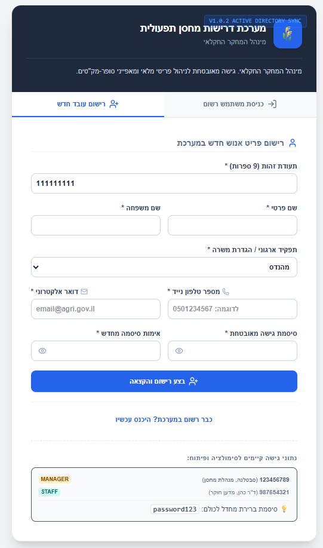
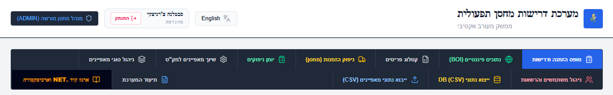
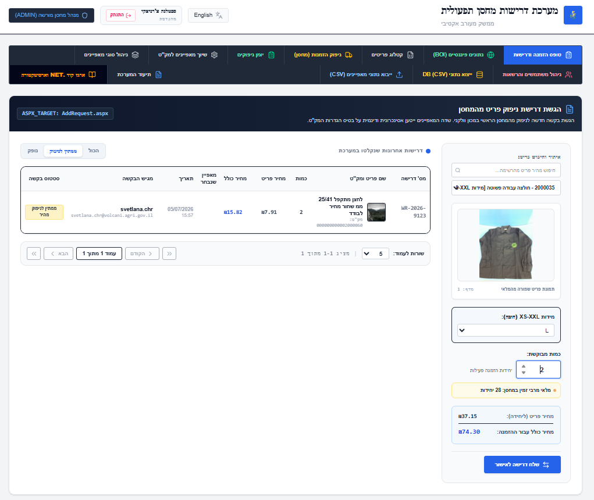
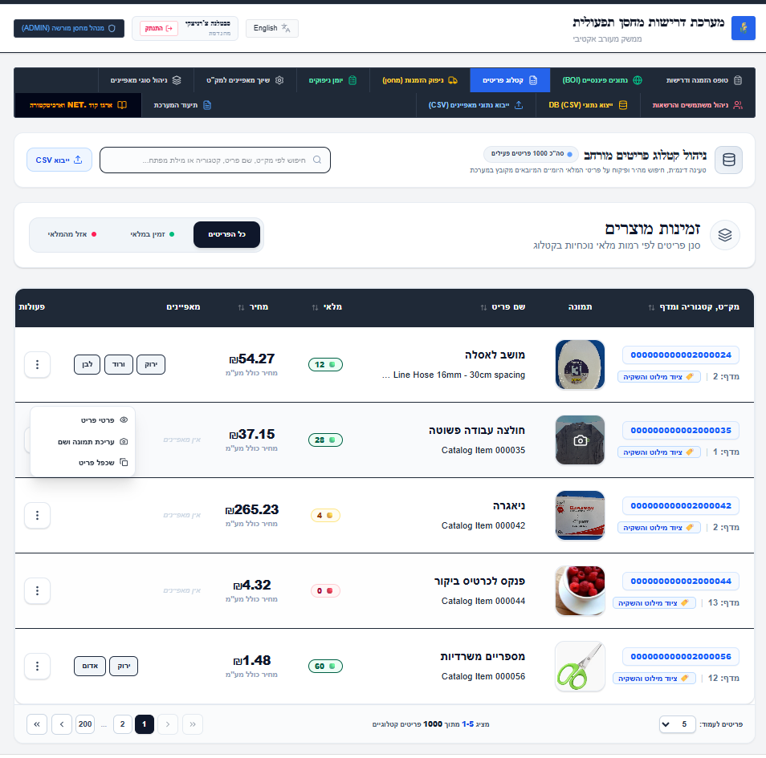
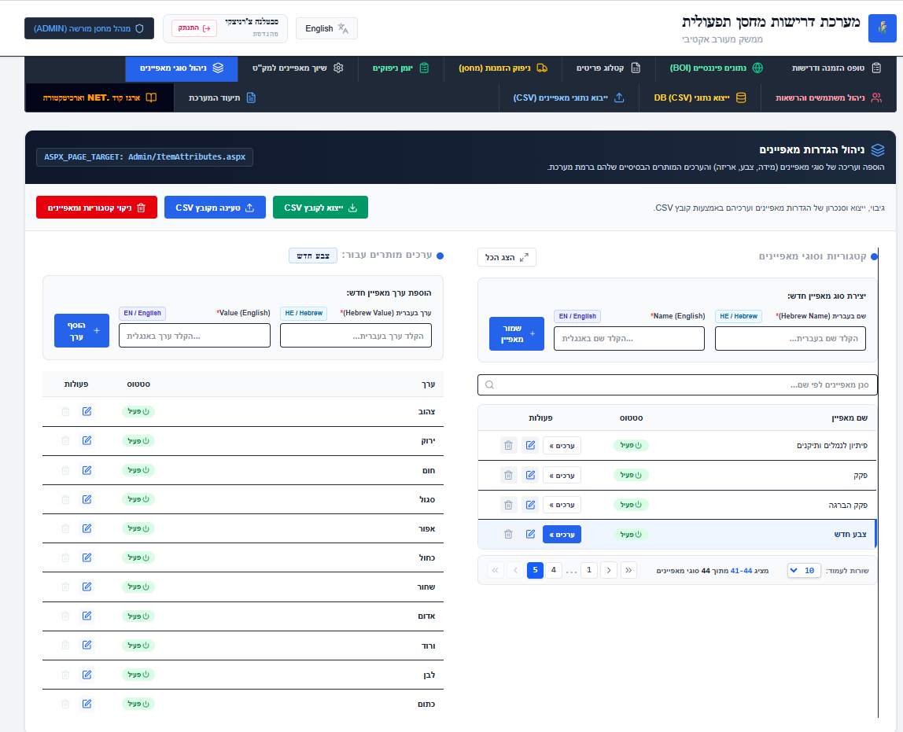
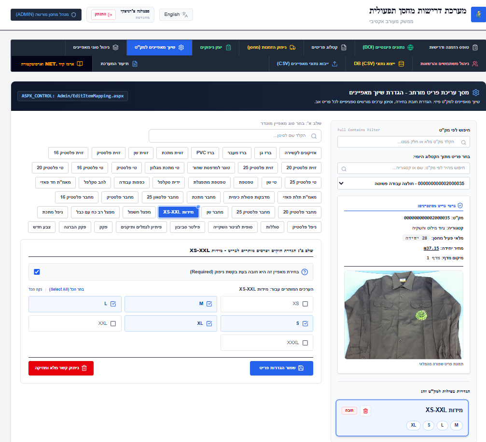
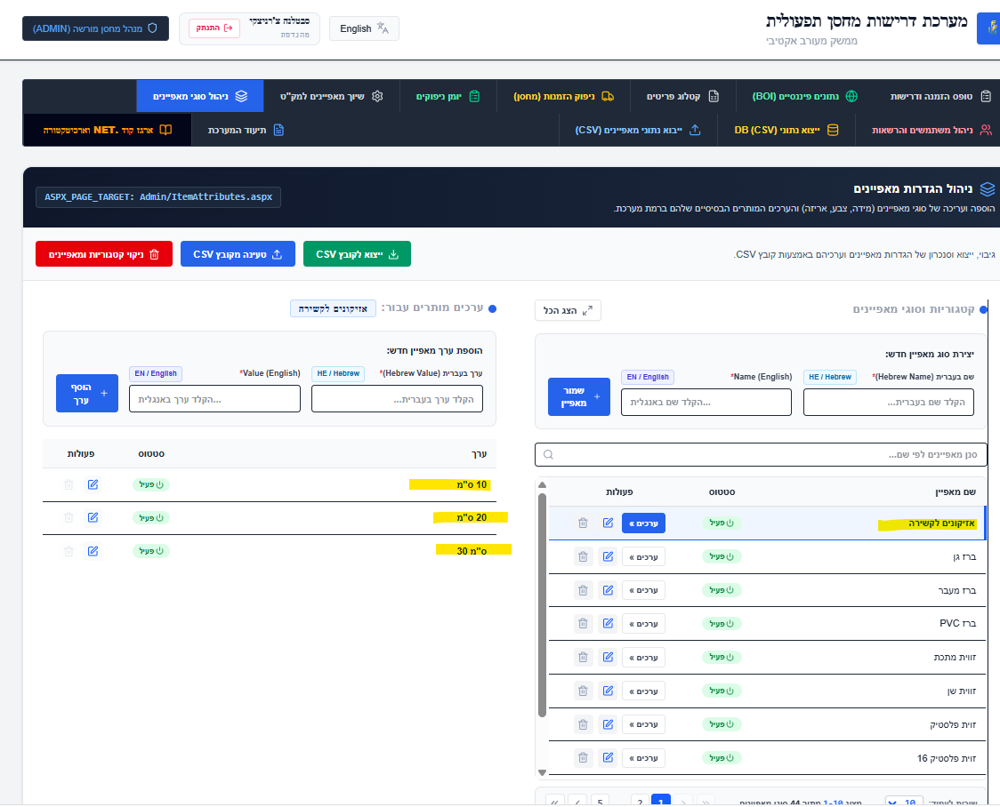
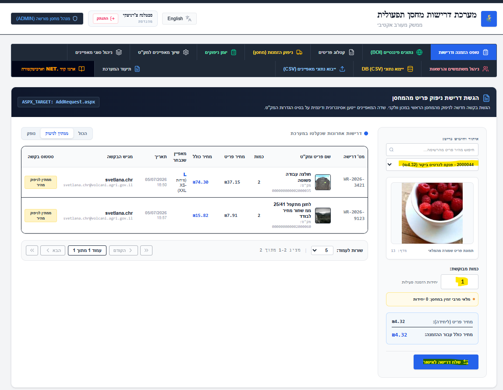
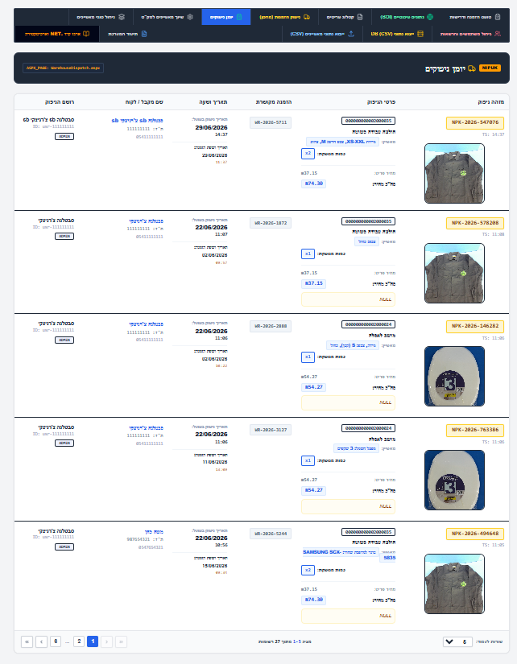
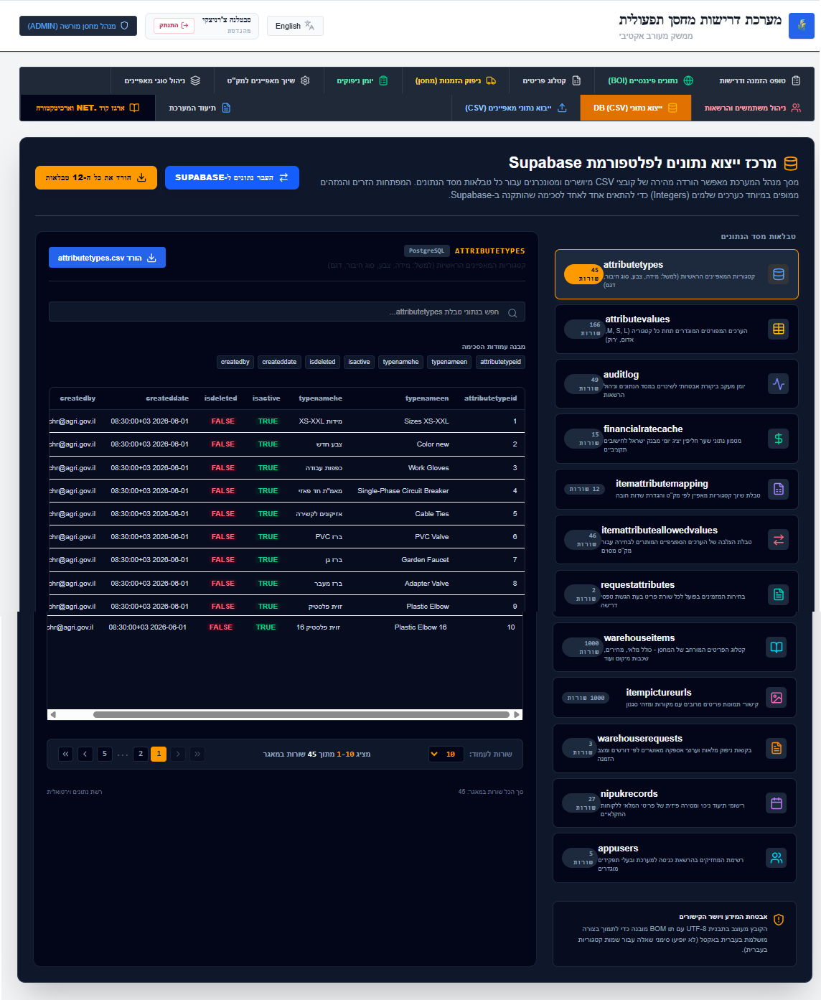

# מערכת בקשות למחסן וניהול מלאי
### מערכת מאפייני פריטים ומלאי

[](https://react.dev/)
[](https://www.typescriptlang.org/)
[](https://vitejs.dev/)
[](https://tailwindcss.com/)
[](https://supabase.com/)
[](https://expressjs.com/)
[](#)

מערכת ארגונית מתקדמת לניהול בקשות למחסן, בקרת מלאי, ניהול מאפיינים דינמיים של פריטים ותהליך ניפוק ציוד למחקר. המערכת פותחה עבור ארגון המחקר החקלאי ומספקת פתרון מודרני, מאובטח ובעל ביצועים גבוהים לניהול לוגיסטי מלא.

---

# 📋 תוכן עניינים

- [תיאור הפרויקט](#-תיאור-הפרויקט)
- [מטרת המערכת](#-מטרת-המערכת)
- [טכנולוגיות](#-טכנולוגיות)
- [התקנה](#-התקנה)
- [מבנה הפרויקט](#-מבנה-הפרויקט)
- [יכולות עיקריות](#-יכולות-עיקריות)
- [סקירת מסכים](#-סקירת-מסכים)
- [צילומי מסך](#-צילומי-מסך)
- [מבנה בסיס הנתונים](#-מבנה-בסיס-הנתונים)
- [אבטחה והרשאות](#-אבטחה-והרשאות)
- [שיפורים עתידיים](#-שיפורים-עתידיים)
- [רישיון](#-רישיון)

---

# 📖 תיאור הפרויקט

**מערכת ניהול המחסן ובקשות הציוד של ארגון המחקר החקלאי** היא מערכת ארגונית מודרנית לניהול מלאי, בקשות ציוד ותהליכי ניפוק.

המערכת פותחה במקור כיישום **ASP.NET Web Forms** המבוסס על **Microsoft SQL Server**, ולאחר מכן עברה מודרניזציה מלאה לארכיטקטורת Web מודרנית הכוללת:

- **React 19** כיישום SPA (Single Page Application)
- **Express.js** כשרת Backend ו-API Proxy
- **Supabase PostgreSQL** כמסד נתונים ענני בזמן אמת

בניגוד למערכות מלאי רגילות, ציוד מחקר דורש מאפיינים דינמיים המשתנים בין פריט לפריט, כגון:

- רמת טוהר (Purity)
- ריכוז כימי
- מתח עבודה
- גודל חיישן
- תאריך כיול
- מאפיינים טכניים נוספים

המערכת מאפשרת להגדיר מאפיינים אלה באופן דינמי ללא צורך בשינוי סכמת מסד הנתונים בכל פעם שמתווסף מאפיין חדש.

בנוסף, המערכת תומכת בניהול קטלוג פריטים, ניהול מלאי, תהליך אישור בקשות, ניפוק ציוד, מעקב אחר משתמשים ובקרת אבטחה מלאה.

---

# 🎯 מטרת המערכת

המערכת מספקת תהליך עבודה דיגיטלי מלא לניהול מחסן ולוגיסטיקה בארגון.

היכולות המרכזיות כוללות:

### 1. ניהול קטלוג פריטים

- ניהול מספרי מק"ט
- מיקום הפריט במחסן
- יחידות מידה
- כמויות במלאי
- מעקב אחר זמינות בזמן אמת

### 2. ניהול מאפיינים דינמיים

אפשרות להוסיף לכל פריט מאפיינים ייחודיים ללא שינוי מבנה מסד הנתונים.

לדוגמה:

- צבע
- גודל
- ריכוז
- חומר
- מתח
- סוג חיישן
- תאריך כיול

### 3. מערכת בקשות למחסן

עובדי המעבדה יכולים:

- לבחור פריטים מהקטלוג
- לראות זמינות בזמן אמת
- למלא מאפיינים נדרשים
- לשלוח בקשות לניפוק

### 4. תהליך ניפוק (ניפוק מחסן)

המחסנאי יכול:

- לאשר בקשות
- להכין ציוד
- לעדכן כמויות שסופקו בפועל
- להפיק תעודת ניפוק
- לתעד חתימות

### 5. אינטגרציה עם שערי מטבע של בנק ישראל

המערכת מושכת מדי יום שערי מטבע רשמיים מבנק ישראל ומאפשרת:

- המרת מחירים
- הצגת מגמות
- שמירת היסטוריה
- עבודה גם במצב Offline באמצעות Cache

---

# 🛠️ טכנולוגיות

## Frontend

### React 19

- ארכיטקטורת SPA
- Functional Components
- React Hooks
- Routing מודרני

### TypeScript 5.8

מספק בדיקות טיפוסים בזמן קומפילציה, אמינות גבוהה וקוד בטוח יותר.

### Vite 6

שרת פיתוח מהיר במיוחד ותהליך Build אופטימלי.

### Tailwind CSS 4

עיצוב Responsive מלא עם תמיכה ב־RTL וב־LTR.

### Motion

אנימציות עדינות, מעברים חלקים וחוויית משתמש מודרנית.

### Lucide Icons

ספריית אייקונים מודרנית ואחידה לכל מסכי המערכת.

---

## Backend

### Node.js + Express 4

- REST API
- Proxy Server
- לוגים
- שירותי רקע

### TSX + Esbuild

מאפשרים הרצת TypeScript ישירות בזמן פיתוח ובניית קבצי Production מהירים ויעילים.

### Proxy לשערי מטבע

שירות הקורא קובצי XML מבנק ישראל וממיר אותם ל־JSON עבור המערכת.

---

## מסד נתונים ואימות משתמשים

### Supabase PostgreSQL

מסד נתונים ענני עם:

- ביצועים גבוהים
- Real-Time
- יתירות
- זמינות גבוהה

### מודל רלציוני

כולל:

- Primary Keys
- Foreign Keys
- Cascades
- Indexes
- Constraints

### Supabase Authentication

מנהל:

- התחברות
- הרשמה
- Sessions
- JWT Tokens
- הרשאות משתמשים

---

## ספריות נוספות

### docx.js

יצירת מסמכי Microsoft Word באופן אוטומטי.

### PDFKit

יצירת מסמכי PDF מקצועיים מתוך נתוני המערכת בזמן אמת.

---

# 🚀 התקנה

## דרישות מקדימות

לפני הפעלת המערכת יש לוודא שמותקנים:

- **Node.js** גרסה **18.0** ומעלה (מומלץ גרסת LTS)
- **npm** גרסה **9.0** ומעלה

---

## הורדת הפרויקט והתקנה

### 1. שכפול (Clone) של המאגר

```bash
git clone <repository-url>
cd agri-warehouse-system
```

### 2. התקנת התלויות

המערכת תתקין באופן אוטומטי את כל תלויות ה־Frontend וה־Backend:

```bash
npm install
```

---

## הגדרת משתני סביבה (Environment Variables)

המערכת משתמשת במשתני סביבה לצורך התחברות למסד הנתונים ולשירותים חיצוניים.

יש ליצור קובץ בשם **`.env`** בתיקיית השורש של הפרויקט ולהגדיר את הערכים בהתאם לקובץ **`.env.example`**.

```env
# Database Credentials
SUPABASE_URL=https://your-project-id.supabase.co
SUPABASE_ANON_KEY=your-anonymous-public-key

# API Integrations
GEMINI_API_KEY=your-gemini-api-key

# Runtime
NODE_ENV=development
```

---

## הפעלת המערכת

### מצב פיתוח (Development)

הפקודה הבאה מפעילה במקביל:

- שרת React באמצעות Vite
- שרת Express
- Proxy API

```bash
npm run dev
```

לאחר ההפעלה ניתן לפתוח את הדפדפן בכתובת:

```text
http://localhost:3000
```

---

### בניית גרסת Production

לבניית קבצי ההפצה ולהפעלת השרת:

```bash
npm run build
npm start
```

במהלך תהליך זה:

- קבצי React נבנים לגרסת Production
- שרת Express מקומפל באמצעות Esbuild
- כל הקבצים נארזים לגרסה אופטימלית לפריסה (Deployment)

---

# 📂 מבנה הפרויקט

להלן סקירה של מבנה התיקיות והקבצים המרכזיים בפרויקט:

```text
├── .env.example                       # קובץ דוגמה למשתני סביבה
├── .gitignore                         # קבצים שאינם נכללים ב-Git
├── AddRequest.aspx / .aspx.cs         # מערכת Web Forms הישנה
├── FinancialData.aspx                 # מסך נתונים פיננסיים (Legacy)
├── FinancialData_CacheTable.sql       # טבלאות SQL Server לשערי מטבע
├── DATABASE_DIAGRAM.md                # תרשים ERD ותיעוד בסיס הנתונים
├── Migrate_Warehouse_Schema.sql       # סקריפטי הגירה
├── Schema_and_Procedures.sql          # Stored Procedures ו-Triggers
├── Supabase_Schema_and_Procedures.sql # סכמת PostgreSQL
├── package.json                       # תלויות ופקודות npm
├── server.ts                          # שרת Express
├── tsconfig.json                      # הגדרות TypeScript
├── vite.config.ts                     # הגדרות Vite
│
├── docs/
│   └── images/                        # צילומי מסך ותרשימי ERD
│
├── src/
│   ├── App.tsx                        # נקודת הכניסה הראשית של React
│   ├── main.tsx                       # טעינת האפליקציה
│   ├── index.css                      # עיצוב גלובלי
│   ├── types.ts                       # הגדרות טיפוסים
│   │
│   ├── assets/                        # תמונות ואייקונים
│   │
│   ├── components/
│   │   ├── EnterpriseLayout.tsx
│   │   ├── AuthScreen.tsx
│   │   ├── RequestForm.tsx
│   │   ├── CatalogManagementForm.tsx
│   │   ├── AttributesManagement.tsx
│   │   ├── ItemMappingForm.tsx
│   │   ├── DispatchManagement.tsx
│   │   ├── UserManagement.tsx
│   │   ├── AdminDataExporter.tsx
│   │   ├── CSVImportManager.tsx
│   │   ├── FinancialDataViewer.tsx
│   │   ├── ArchitectHub.tsx
│   │   └── ProjectDocumentation.tsx
│   │
│   ├── data/                          # נתוני ברירת מחדל וקבצי לוקליזציה
│   ├── lib/                           # פונקציות עזר
│   └── services/
│       └── dbService.ts               # שכבת הגישה למסד הנתונים
```

---

## הסבר על רכיבי המערכת

### 📁 docs/

כוללת את כל מסמכי הפרויקט:

- מדריך משתמש
- תיעוד טכני
- צילומי מסך
- תרשימי בסיס הנתונים

---

### 📁 src/

תיקיית קוד המקור הראשית של המערכת.

---

### 📁 components/

מכילה את כל מסכי המערכת ורכיבי הממשק.

לדוגמה:

| רכיב | תפקיד |
|-------|--------|
| **AuthScreen** | מסך התחברות והרשמה |
| **RequestForm** | הגשת בקשות למחסן |
| **CatalogManagementForm** | ניהול קטלוג הפריטים |
| **AttributesManagement** | ניהול סוגי מאפיינים |
| **ItemMappingForm** | שיוך מאפיינים לפריטים |
| **DispatchManagement** | ניהול תהליך הניפוק |
| **FinancialDataViewer** | שערי מטבע |
| **UserManagement** | ניהול משתמשים |
| **AdminDataExporter** | ייצוא נתונים ולוגים |
| **ProjectDocumentation** | תיעוד טכני ומדריך משתמש |

---

### 📁 services/

שכבת הגישה למסד הנתונים.

היא מרכזת את כל פעולות ה־CRUD מול Supabase ומפרידה בין הלוגיקה העסקית לבין קוד ממשק המשתמש.

---

### 📁 assets/

כוללת:

- תמונות
- לוגואים
- אייקונים
- קבצי מדיה

---

### 📁 data/

מכילה נתוני מערכת קבועים, ערכי ברירת מחדל וקובצי תרגום.

---

### 📁 lib/

כוללת פונקציות עזר (Utilities) המשמשות מספר רכיבים במערכת.

---

# ✨ יכולות עיקריות

המערכת מספקת מגוון רחב של יכולות לניהול מלאי של מחסן ארגוני, החל מניהול קטלוג הפריטים ועד לניפוק ציוד, בקרת מלאי, ניהול הרשאות ותיעוד מלא של כל פעולה.

## 🔐 התחברות והרשאות מאובטחות

- התחברות באמצעות דואר אלקטרוני וסיסמה
- אימות מספר תעודת זהות ישראלית (9 ספרות)
- הרשמת משתמשים חדשים
- ניהול Session באמצעות JWT
- תמיכה בהרשאות משתמשים לפי תפקיד

---

## 🌍 תמיכה מלאה בעברית ובאנגלית

המערכת פותחה מראש כמערכת דו־לשונית.

כוללת:

- תמיכה מלאה ב־RTL וב־LTR
- מעבר מיידי בין עברית לאנגלית
- כפתורים, טפסים וטבלאות בשתי השפות
- שמירת שמות מאפיינים וערכים בעברית ובאנגלית

---

## 🏷️ מנגנון מאפיינים דינמיים

זהו אחד המרכיבים המרכזיים של המערכת.

במקום להוסיף עמודות חדשות למסד הנתונים עבור כל מאפיין חדש, ניתן להגדיר מאפיינים דינמיים כגון:

- צבע
- גודל
- סוג חומר
- ריכוז
- מתח עבודה
- סוג חיישן
- תאריך כיול
- וכל מאפיין אחר

לכל סוג פריט ניתן להגדיר אילו מאפיינים רלוונטיים.

---

## ✅ ערכים מותרים (Allowed Values)

לכל מאפיין ניתן להגדיר רשימת ערכים מותרים בלבד.

לדוגמה:

**צבע**

- אדום
- כחול
- ירוק

או

**גודל**

- Small
- Medium
- Large

כך נמנעות טעויות בהזנת נתונים ונשמרת אחידות במערכת.

---

## 📦 מערכת ניפוק למחסן

מסך העבודה של המחסנאי מאפשר:

- צפייה בכל הבקשות הפתוחות
- בדיקת זמינות מלאי
- עדכון הכמות שסופקה בפועל
- אישור ניפוק
- הדפסת תעודת משלוח
- רישום חתימות

---

## 💱 ניהול שערי מטבע

המערכת מתחברת אוטומטית לנתוני בנק ישראל.

היא מאפשרת:

- עדכון יומי של שערי מטבע
- שמירת היסטוריה
- הצגת מגמות
- עבודה גם כאשר אין חיבור לרשת באמצעות Cache

---

## 🔍 Audit Log מלא

כל שינוי במערכת נשמר באופן אוטומטי.

כולל:

- יצירת רשומות
- עדכון נתונים
- מחיקה
- שיוך מאפיינים
- שינוי הרשאות

לכל פעולה נשמרים:

- המשתמש שביצע אותה
- זמן הפעולה
- כתובת IP
- הנתונים לפני השינוי
- הנתונים לאחר השינוי

---

## 📄 ייבוא וייצוא נתונים

המערכת מאפשרת:

- ייבוא קטלוג פריטים מקובצי CSV
- בדיקת תקינות הנתונים
- התאמת עמודות אוטומטית
- ייצוא נתונים לקבצים

---

## 📱 ממשק Responsive

הממשק מותאם ל:

- מחשבים שולחניים
- מחשבים ניידים
- טאבלטים

הרכיבים מוצגים בהתאם להרשאות המשתמש.

---

## 💾 עבודה רציפה גם במקרה של ניתוק

במקרה של נפילת תקשורת זמנית:

- הנתונים נשמרים מקומית
- הפעולות מסונכרנות לאחר חזרת החיבור
- נמנע אובדן מידע

---

# 🖥️ סקירת מסכי המערכת

## 1. מסך התחברות והרשמה (AuthScreen)

### מטרת המסך

כניסה מאובטחת למערכת.

### פונקציות עיקריות

- התחברות
- הרשמת משתמש חדש
- אימות תעודת זהות
- שחזור גישה

### משתמשים מורשים

כל המשתמשים הרשומים במערכת.

---

## 2. מסך בקשות למחסן (RequestForm)

זהו המסך הראשי של משתמשי הקצה.

### מאפשר:

- חיפוש פריטים
- צפייה בזמינות
- בחירת מאפיינים
- הזנת כמויות
- שליחת בקשות
- יצירת מסמכי Word ו־PDF

### הרשאות

- STAFF
- STOREKEEPER
- MANAGER
- ADMIN

---

## 3. ניהול קטלוג פריטים (CatalogManagementForm)

מיועד למנהלי המחסן.

### מאפשר

- יצירת פריטים חדשים
- עריכת פריטים
- העלאת תמונות
- עדכון מלאי
- שינוי מיקום במחסן
- מחיקת פריטים

### הרשאות

- STOREKEEPER
- MANAGER
- ADMIN

---

## 4. ניהול סוגי מאפיינים (AttributesManagement)

מסך ניהול מרכזי להגדרת כל סוגי המאפיינים במערכת.

לדוגמה:

- צבע
- גודל
- חומר
- ריכוז
- מתח
- יצרן

### פעולות

- הוספה
- עריכה
- מחיקה
- הפעלה/השבתה

### הרשאות

MANAGER ו־ADMIN בלבד.

---

## 5. שיוך מאפיינים לפריטים (ItemMappingForm)

מסך המאפשר לקבוע אילו מאפיינים שייכים לכל פריט.

לדוגמה:

הפריט:

> כבל חשמל

יכול לקבל:

- אורך
- צבע
- מתח

ואילו הפריט:

> מבחנה

יכול לקבל:

- נפח
- חומר
- סטריליות

בנוסף ניתן להגדיר האם המאפיין הוא חובה.

---

## 6. ניהול ערכים מותרים

מסך המשמש להגדרת הערכים האפשריים עבור כל מאפיין.

לדוגמה:

**צבע**

- אדום
- כחול
- ירוק

או

**חומר**

- פלסטיק
- זכוכית
- מתכת

כולל תמיכה בעברית ובאנגלית.

---

## 7. פרטי בקשה

מציג את כל פרטי בקשת הניפוק.

כולל:

- הפריטים המבוקשים
- המאפיינים שנבחרו
- סטטוס הבקשה
- היסטוריית אישורים
- חתימות
- אפשרות להדפסה

---

## 8. מסך ניפוק (DispatchManagement)

עמדת העבודה הראשית של המחסנאי.

מאפשרת:

- אישור בקשות
- עדכון הכמויות שסופקו
- רישום חתימות
- הדפסת תעודות משלוח
- שינוי סטטוס הבקשה

---

## 9. לוג אבטחה (AdminDataExporter)

מסך המיועד למנהלי מערכת בלבד.

כולל:

- צפייה בכל פעולות המשתמשים
- סינון לפי סוג פעולה
- חיפוש
- ייצוא ל־CSV
- מעקב אחר שינויים במסד הנתונים

---

## 10. שערי מטבע (FinancialDataViewer)

מציג נתוני מטבע עדכניים מבנק ישראל.

כולל:

- שערים יומיים
- גרפי מגמות
- היסטוריה
- המרות מטבע
- עדכון Cache

---

# 🖼️ צילומי מסך וסיור במערכת

להלן סקירה חזותית של המסכים המרכזיים במערכת.

---

## מסך התחברות



**מסך התחברות מאובטח** הכולל אימות משתמש באמצעות דואר אלקטרוני, סיסמה ומספר תעודת זהות ישראלית. המסך מהווה את שער הכניסה לכל משתמשי המערכת.

---

## לוח הבקרה הראשי



לוח בקרה מרכזי המציג תמונת מצב עדכנית של:

- בקשות פעילות
- מצב המלאי
- התראות מערכת
- נתוני שערי מטבע
- מידע תפעולי בזמן אמת

---

## רשימת בקשות למחסן



מסך המרכז את כל בקשות הניפוק במערכת.

ניתן לצפות בסטטוס כל בקשה:

- חדשה
- בטיפול
- אושרה
- נופקה
- הושלמה

---

## ניהול קטלוג פריטים



מסך לניהול כלל פריטי המחסן.

כולל:

- מק"ט
- שם פריט
- תיאור
- כמות במלאי
- מיקום במחסן
- תמונת הפריט
- עריכת נתונים

---

## ניהול סוגי מאפיינים



מסך לניהול כל סוגי המאפיינים במערכת.

לדוגמה:

- צבע
- גודל
- חומר
- מתח
- ריכוז
- יצרן

המערכת תומכת בעברית ובאנגלית עבור כל מאפיין.

---

## שיוך מאפיינים לפריטים



מסך המאפשר לקבוע אילו מאפיינים שייכים לכל פריט.

בנוסף ניתן:

- להגדיר האם המאפיין חובה
- לבחור ערכים מותרים
- לשמור תצורות שונות לכל מק"ט

---

## ערכים מותרים



מסך לניהול רשימות הערכים האפשריים עבור כל מאפיין.

באמצעותו ניתן למנוע הזנת ערכים שגויים ולהבטיח אחידות בנתוני המערכת.

---

## פרטי בקשה



מסך המציג את כל פרטי בקשת הניפוק.

כולל:

- פרטי הפריטים
- מאפיינים שנבחרו
- היסטוריית אישורים
- חתימות
- אפשרות להדפסה

---

## יומן ביקורת (Audit Log)



מסך המציג את כל השינויים שבוצעו במערכת.

כל פעולה מתועדת, לרבות:

- המשתמש שביצע את הפעולה
- תאריך ושעה
- הנתונים לפני השינוי
- הנתונים לאחר השינוי

---

## הגדרות מערכת



מסך לניהול הגדרות המערכת והרשאות משתמשים.

כולל:

- ניהול משתמשים
- ייצוא נתונים
- סנכרון Cache
- הגדרות מערכת

---

# 📊 מבנה בסיס הנתונים

## תרשים ישויות וקשרים (ER Diagram)

מבנה בסיס הנתונים תוכנן כך שיאפשר הוספת מאפיינים דינמיים לפריטים ללא צורך בשינוי סכמת מסד הנתונים.

המודל שומר על:

- שלמות נתונים (Data Integrity)
- קשרי Foreign Key
- מניעת כפילויות
- ביצועים גבוהים
- הרחבה קלה של המערכת

> **הערה:** תרשים ה־Mermaid המופיע בהמשך נשאר באנגלית, מאחר שהוא מייצג את שמות הישויות והטבלאות בפועל במסד הנתונים.

```mermaid
erDiagram
    AttributeTypes ||--o{ AttributeValues : "has (one-to-many)"
    AttributeTypes ||--o{ ItemAttributeMapping : "defines (one-to-many)"
    ItemAttributeMapping ||--o{ ItemAttributeAllowedValues : "constrains (one-to-many)"
    AttributeValues ||--o{ ItemAttributeAllowedValues : "allows (one-to-many)"
    
    ItemAttributeMapping ||--o{ RequestAttributes : "references"
    AttributeValues ||--o{ RequestAttributes : "selected_in"
    
    AttributeTypes {
        int AttributeTypeId PK "IDENTITY(1,1)"
        nvarchar TypeNameEn UK "NOT NULL"
        nvarchar TypeNameHe UK "NOT NULL"
        bit IsActive "DEFAULT 1"
        bit IsDeleted "DEFAULT 0"
        datetime CreatedDate "DEFAULT GETDATE()"
        nvarchar CreatedBy "NOT NULL"
    }

    AttributeValues {
        int AttributeValueId PK "IDENTITY(1,1)"
        int AttributeTypeId FK "NOT NULL"
        nvarchar ValueNameEn "NOT NULL"
        nvarchar ValueNameHe "NOT NULL"
        bit IsActive "DEFAULT 1"
        bit IsDeleted "DEFAULT 0"
        datetime CreatedDate "DEFAULT GETDATE()"
        nvarchar CreatedBy "NOT NULL"
    }

    ItemAttributeMapping {
        nvarchar SKU PK "NOT NULL"
        int AttributeTypeId PK_FK "NOT NULL"
        bit IsMandatory "DEFAULT 0"
        datetime CreatedDate "DEFAULT GETDATE()"
        nvarchar CreatedBy "NOT NULL"
    }

    ItemAttributeAllowedValues {
        nvarchar SKU PK_FK "NOT NULL"
        int AttributeTypeId PK_FK "NOT NULL"
        int AttributeValueId PK_FK "NOT NULL"
    }

    RequestAttributes {
        int RequestLineId PK "NOT NULL"
        nvarchar SKU "NOT NULL"
        int AttributeTypeId FK "NOT NULL"
        int AttributeValueId FK "NOT NULL"
        nvarchar SelectedValueTextHe "NOT NULL"
        nvarchar SelectedValueTextEn "NOT NULL"
    }

    FinancialRateCache {
        int CacheId PK "IDENTITY(1,1)"
        date RateDate UK "NOT NULL"
        varchar CurrencyCode UK "NOT NULL"
        nvarchar CurrencyNameHe "NOT NULL"
        varchar CurrencyNameEn "NOT NULL"
        int Unit "DEFAULT 1"
        decimal ExchangeRate "NOT NULL"
        decimal LastTrend "DEFAULT 0.0"
        decimal TrendPercent "DEFAULT 0.0"
        datetime FetchedAt "DEFAULT GETDATE()"
    }

    AuditLog {
        bigint AuditLogId PK "IDENTITY(1,1)"
        nvarchar UserId "NOT NULL"
        nvarchar ActionType "NOT NULL"
        nvarchar TableName "NOT NULL"
        nvarchar OldValue "NULL"
        nvarchar NewValue "NULL"
        datetime ActionDate "DEFAULT GETDATE()"
        nvarchar IPAddress "NULL"
    }
```

---

## מילון הטבלאות

### AttributeTypes

טבלת האב של סוגי המאפיינים.

דוגמאות:

- צבע
- גודל
- חומר
- מתח

---

### AttributeValues

מכילה את הערכים האפשריים לכל סוג מאפיין.

לדוגמה:

עבור צבע:

- אדום
- כחול
- ירוק

---

### WarehouseItems

טבלת הפריטים הראשית.

כוללת:

- מק"ט
- שם פריט
- תיאור
- כמות
- יחידת מידה
- מיקום במחסן

---

### ItemPictureUrls

מאחסנת תמונות של פריטי המחסן.

---

### ItemAttributeMapping

מגדירה אילו מאפיינים שייכים לכל פריט.

בנוסף ניתן לקבוע האם המאפיין הוא חובה.

---

### ItemAttributeAllowedValues

קובעת אילו ערכים מותרים לכל מאפיין של כל פריט.

---

### WarehouseRequests

טבלת בקשות הניפוק.

כוללת:

- מבקש
- תאריך
- פריטים
- סטטוס
- אישורים

---

### NipukRecords

טבלת הניפוקים בפועל.

כוללת:

- כמויות שסופקו
- מחסנאי
- חתימות
- תאריך ניפוק

---

### FinancialRateCache

טבלת Cache של שערי המטבע.

הנתונים מתעדכנים מדי יום מבנק ישראל.

---

### AuditLog

יומן ביקורת מלא.

כל פעולה במערכת מתועדת בטבלה זו.

---

# 🔒 אבטחה והרשאות

## תהליך ההתחברות

המערכת עושה שימוש במנגנון התחברות מאובטח הכולל:

1. אימות משתמש באמצעות דואר אלקטרוני וסיסמה.
2. אימות מספר תעודת זהות.
3. יצירת Session באמצעות JWT.
4. בקרת הרשאות בכל קריאת API.

---

## בקרת הרשאות (RBAC)

המערכת מגדירה ארבע רמות הרשאה עיקריות:

### 👑 ADMIN

גישה מלאה למערכת.

כולל:

- ניהול משתמשים
- הרשאות
- לוגים
- הגדרות מערכת
- ייצוא נתונים

---

### 📋 MANAGER

אחראי על ניהול המחסן.

יכול:

- לנהל קטלוג
- לאשר בקשות
- לנהל מאפיינים
- לבצע שיוכים

---

### 📦 STOREKEEPER

אחראי על הניפוק.

יכול:

- לאשר אספקה
- לעדכן מלאי
- להדפיס תעודות
- לעדכן כמויות

---

### 🔬 STAFF

משתמש קצה.

יכול:

- להגיש בקשות
- לצפות בבקשות שלו
- לחפש פריטים
- לעקוב אחר סטטוס הבקשות

---

## Audit Log

כל פעולה משמעותית נשמרת אוטומטית.

המערכת מתעדת:

- יצירה
- עדכון
- מחיקה
- שינוי הרשאות
- שיוך מאפיינים

וכן:

- המשתמש
- זמן הפעולה
- כתובת IP
- נתונים לפני השינוי
- נתונים לאחר השינוי

---

# 🔮 שיפורים עתידיים

המערכת תוכננה כך שניתן יהיה להרחיבה בעתיד בקלות.

שיפורים אפשריים:

### 📷 סריקת ברקודים ו־QR

שימוש במצלמת טאבלט או טלפון לזיהוי מהיר של פריטים במחסן.

---

### 🤖 חיזוי מלאי באמצעות בינה מלאכותית

ניתוח בקשות עבר לצורך:

- חיזוי צריכה
- המלצה על השלמת מלאי
- זיהוי מחסור עתידי

---

### 🌐 עבודה מלאה במצב Offline

באמצעות:

- Service Workers
- IndexedDB

ניתן יהיה לבצע ניפוקים גם ללא חיבור לאינטרנט ולסנכרן את הנתונים לאחר חזרת החיבור.

---

### ✍️ חתימה דיגיטלית

הוספת רכיב חתימה במסך הניפוק לצורך:

- חתימת מקבל הציוד
- שמירת החתימה במסמכי PDF
- תיעוד מלא של תהליך האספקה

---

# 📄 רישיון

תוכנה זו היא מערכת ארגונית קניינית (Proprietary Enterprise Software), שפותחה עבור ארגון המחקר החקלאי.

כל הזכויות שמורות.

אין להעתיק, להפיץ, לבצע הנדסה לאחור (Reverse Engineering) או לעשות כל שימוש אחר במערכת ללא אישור מפורש מבעלי הזכויות.

---

## סיכום

מערכת **ניהול המחסן ובקשות הציוד** מספקת פתרון מודרני, מאובטח וגמיש לניהול תהליכי מחסן בארגון.

המערכת משלבת:

- ניהול מלאי מתקדם
- מאפיינים דינמיים לפריטים
- ניהול בקשות וניפוק
- אינטגרציה עם שירותים חיצוניים
- תמיכה מלאה בעברית ובאנגלית
- בקרת הרשאות מתקדמת
- Audit Log מלא
- ארכיטקטורת React + Express + Supabase מודרנית

המערכת תוכננה בהתאם לעקרונות של **Scalability**, **Maintainability**, **Security** ו־**Performance**, ומהווה בסיס איכותי להמשך פיתוח והרחבה בעתיד.
